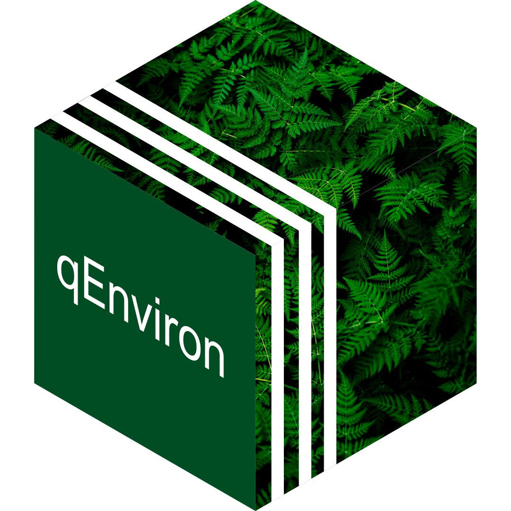

# qEnviron 

<!-- badges: start -->

[](https://www.tidyverse.org/lifecycle/#experimental)


<!-- badges: end -->

qEnviron is the second qPackage in the
[qData](https://github.com/globalgov/qData) ecosystem. It currently
includes an ensemble of datasets on international environmental
agreements, and [states](https://github.com/globalgov/qStates)’
membership or other relationships to those agreements.

## How to install

We’ve made it easier than ever to install and start analysing global
governance data in R. Simply install the core package,
[qData](https://github.com/globalgov/qData), as follows, and then you
can discover, install and update various qPackages from the console.

``` r
# install.packages(remotes)
remotes::install_github("globalgov/qData") # this installs our core package, the only one you need to do independently
qData::get_packages() # this prints a list of the publicly available data packages currently available
qData::get_packages("qStates") # this downloads and installs the named package
```

## Data included

Once you have installed the package, you can see the different databases
and datasets included in the package using the following function.

``` r
qData::data_contrast("qEnviron")
```

    ## agreements :
    ##        Unique ID Missing Data Rows Columns        Beg       End
    ## IEADB          0        3.4 % 3666       8 1351-08-01        NA
    ## GNEVAR         0      40.53 % 3469      14 1351-08-01 Obsolete?
    ## ECOLEX         0       6.65 % 2174       8 1868-10-17        NA
    ## CIESIN         0          0 %  666       5       1868        NA
    ##                                                URL
    ## IEADB  https://iea.uoregon.edu/base-agreement-list
    ## GNEVAR                                          NA
    ## ECOLEX  https://www.ecolex.org/result/?type=treaty
    ## CIESIN    https://sedac.ciesin.columbia.edu/entri/
    ## 
    ## memberships :
    ##            Unique ID Missing Data  Rows Columns        Beg        End
    ## ECOLEX_MEM         0      24.96 % 25003       9 1192-06-12 2017-12-31
    ## GNEVAR_MEM         0       28.6 % 35671      12 1192-06-12 9999-12-31
    ## IEADB_MEM          0      28.94 % 27410      10 1900-05-19 2020-11-14
    ## TFDD_MEM           0       2.14 %  2118       6 1900-01-03         NA
    ##                                                             URL
    ## ECOLEX_MEM           https://www.ecolex.org/result/?type=treaty
    ## GNEVAR_MEM                                                   NA
    ## IEADB_MEM               https://iea.uoregon.edu/country-members
    ## TFDD_MEM   https://transboundarywaters.science.oregonstate.edu/
    ## 
    ## organizations :
    ##     Unique ID Missing Data Rows Columns  Beg End
    ## MIA         0         25 %   78       4 1831  NA
    ##                                                             URL
    ## MIA https://garymarks.web.unc.edu/data/international-authority/
    ## 
    ## references :
    ##     Unique ID Missing Data Rows Columns Beg End URL
    ## REF         0          0 % 2174       1  NA  NA  NA

Working with ensembles of related data has many advantages for robust
analysis. Just take a look at our vignettes
[here](https://globalgov.github.io/qData/articles/user.html).

While some qPackages can and do include novel data, much of what they
offer involves standing on the shoulders of giants. qPackages endeavour
to be as transparent as possible about where data comes from, how it has
been coded and/or relabelled, and who has done the work. As such, we
make it easy to cite both the particular datasets you use by listing the
official references in the function above, as well as the package
providers for their work assembling the data using the function below.

``` r
citation("qEnviron")
```

    ## 
    ## To cite qEnviron in publications use:
    ## 
    ##   J. Hollway. Environmental agreements for qData. 2021.
    ## 
    ## A BibTeX entry for LaTeX users is
    ## 
    ##   @Manual{,
    ##     title = {qEnviron: Environmental agreements for qData},
    ##     author = {James Hollway},
    ##     year = {2021},
    ##     url = {https://github.com/globalgov/qEnviron},
    ##   }

## Contributing

[qData](https://github.com/globalgov/qData) also makes it easy to
contribute in lots of different ways.

If you have already developed a dataset salient to this package, please
reach out by flagging this as an
[issue](https://github.com/globalgov/qEnviron/issues) for us, or by
forking, further developing the package yourself, and opening a [pull
request](https://github.com/globalgov/qEnviron/pulls) so that your data
can be used easily.

If you have collected or developed other data that may not be best for
this package, but could be useful within the wider ecosystem,
[qData](https://github.com/globalgov/qData) includes a number of
functions that make it easy to create a new qPackage and populate with
clean, consistent global governance data.

If you have any other ideas about how this package or the qData
ecosystem more broadly might better facilitate your empirical analysis,
we’d be very happy to hear from you.
