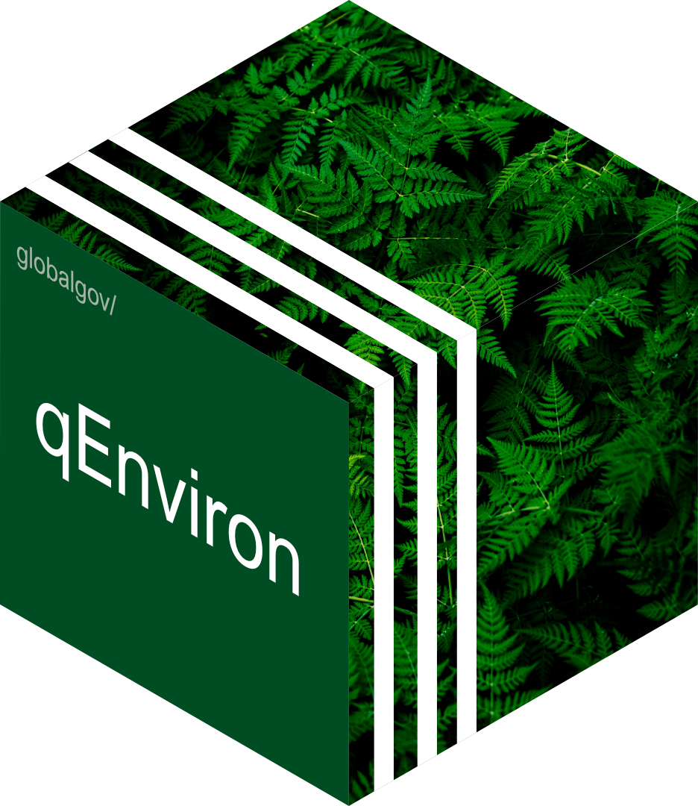

# qEnviron 

<!-- badges: start -->

[](https://www.tidyverse.org/lifecycle/#experimental)


<!-- [](http://hits.dwyl.com/globalgov/qStates) -->
<!-- [](https://codecov.io/gh/globalgov/qStates?branch=main) -->
<!--  -->
<!-- badges: end -->

qEnviron is a hush-hush secret project (for now) by James Hollway,
Henrique Sposito. Please watch this space.

Check out [qData](https://github.com/globalgov/qData) for more.

## Data included

``` r
qData::report_data(pkg = "qEnviron")
```

    ##        Unique ID Rows Columns Beg          End         
    ## IEADB  3666      3666 3       "NA"         "NA"        
    ## GNEVAR 2733      2733 4       "NA"         "NA"        
    ## ECOLEX 2174      2174 3       "1868-10-17" "2018-03-04"
    ##        URL                                          
    ## IEADB  "https://iea.uoregon.edu/base-agreement-list"
    ## GNEVAR "https://github.com/jhollway/gnevar"         
    ## ECOLEX "https://www.ecolex.org/result/?type=treaty" 
    ##        Reference                                                                                                        
    ## IEADB  "Mitchell RB, Andonova LB (2020). "What we know (and could know) aboutinternational environmental ag" [truncated]
    ## GNEVAR "Francois R (2020). _bibtex: Bibtex Parser_. R package version 0.4.2.3,<URL: https://CRAN.R-project." [truncated]
    ## ECOLEX "Parris TM (2001). "Keeping tracks of treaties revisited."_Environment_, *43*(7), 3."
