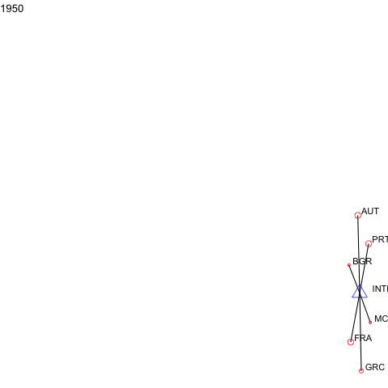

```{r setup, include=FALSE}
knitr::opts_chunk$set(collapse = TRUE, comment = "#>")
options(rmarkdown.html_vignette.check_title = FALSE)
```

## manyenviron Data

`{manyenviron}` stores several datasets on various aspects of environmental treaties in different datacubes.
For example, the **Agreements** datacube is made of multiple datasets of environmental treaty titles with
specific information such as the agreement type (e.g. agreements, protocols, amendments, declarations), if
they are bilateral or multilateral, and some important dates such as the signature or entry into force.
The **Memberships** datacube contains lists of countries with the treaties to which they are parties to. It
also includes information on the signature date of the treaty or the withdrawal date of a party.
The **References** datacube is composed of a dataset that indicates the relationship (e.g. amended by,
cites, superseded by) between two treaties. Finally, the **Texts** datacube stores the text of
environmental treaties.

For a quick overview of the datacube and dataset in `{manyenviron}`, we can use the `data_contrast()` function from `{manydata}`.

```{r, eval=FALSE}
library(manydata)
manydata::compare_dimensions(manyenviron::agreements)
manydata::compare_dimensions(manyenviron::memberships)
```

To view the bibliographic references for a dataset, a datacube, or the whole package, we can also use `code_source()` from `{manydata}`.

```{r, eval=FALSE}
manydata::call_sources("manyenviron", "agreements", "IEADB")
manydata::call_sources("manyenviron", "memberships")
```

## Connecting Environmental Treaties

There are many different ways in which treaties could be linked.
For example, a treaty can be substituted by another, complemented by protocols,
changed through amendments, and/or cite another treaty.
To facilitate the identification and connection between the datacubes in the package, the `manypkgs::code_agreements()` function has been developed to generate a treatyID for treaties in a datacube.
Each of the `{manyenviron}` dataset contains a treatyID column.
To understand what are the information provided through by the treatyID,
as well as the benefits of using treatyID to spot the relationships between the treaties across several datasets
in a datacube, please visit this [article](https://globalgov.github.io/manypkgs/articles/agreements.html)
on the `{manypkgs}` website.

Below are three examples of how to visualise treaty linkages for the references and the
memberships datacubes in `{manyenviron}`.
We use `{manynet}` to create the network plots, more information about the package can be found
[here](https://stocnet.github.io/manynet/).

### Visualising How Agreements Connect by References

The graph below illustrates a sample of earliest 25 treaties from the references datacube. We select only treaties that cite other treaties. The treatyIDs are used to facilitate the reading and illustration of the relationships.

```{r lineage, warning=FALSE, message=FALSE, fig.align='center', fig.asp=1.2, fig.width=7}
library(dplyr)
library(ggplot2)
library(tidygraph)
library(stringr)
library(manynet)
library(migraph)
# Get the dataset and plot with manynet
manyenviron::references$ECOLEX_REF %>%
  distinct() %>%
  filter(RefType == "Cites", !grepl(":", treatyID1),
         !grepl(":", treatyID2)) %>%
  as_tidygraph() %>%
  mutate(year = as.numeric(stringr::str_extract(name, "[:digit:]{4}"))) %>%
  filter(year > 1979, year < 2000) %>%
  to_no_isolates() %>%
  autographr(layout = "lineage", rank = "year", node_size = 3,
             node_color = "year") +
  labs(title = "Treaty Lineage of Selected Agreements",
       caption = "Source: manyenviron") +
  theme(plot.title = element_text(family = "sans", size = 18, hjust = 0.5)) +
  theme_ethz()
```

We can also take a look at a single lineage of Enviromental treaties.
Let's look at treaties that either cite or ammend the Ramsar Convention on Wetlands of International Importance Especially as Waterfowl Habitat ("RAMSA_1971A").

```{r ramsar, warning=FALSE, message=FALSE, fig.align='center', fig.asp=1.2, fig.width=7}
manyenviron::references$ECOLEX_REF %>%
  dplyr::filter(treatyID2 == "RAMSA_1971A") %>%
  manynet::as_tidygraph() %>%
  mutate(year = as.numeric(stringr::str_extract(name, "[:digit:]{4}")),
         center = ifelse(name == "RAMSA_1971A", 1, 2)) %>%
  manynet::autographr(layout = "lineage", rank = "year",
                      edge_color = "RefType", node_color = "center")  +
  scale_color_sdgs(guide = "none") +
  scale_edge_color_centres() +
  labs(title = "Treaties that cite or ammend the Ramsar Convention 1971",
       caption = "Source: manyenviron") +
  theme_iheid()
```

### Visualising How Agreements Connect by Country Membership and by Year

Or we can look at countries part of Enviromental treaties for certain years.
The graph below illustrates the connection between parties and treaties for multilateral environmental agreements signed into force in the year of 1980 using the memberships database.

```{r 1980, warning=FALSE, message=FALSE, fig.align='center', fig.asp=1.2, fig.width=7}
manyenviron::memberships$IEADB_MEM %>%
  dplyr::mutate(year = stringr::str_extract(manyID, "[:digit:]{4}")) %>%
  dplyr::filter(year == "1980") %>%
  dplyr::select(treatyID, stateID, year) %>%
  group_by(treatyID) %>%
  filter( n() > 2) %>% # keep only multilateral treaties
  manynet::as_tidygraph() %>%
  activate(nodes) %>%
  dplyr::mutate(color = ifelse(grepl("_", name), "Treaty", "Country"),
                size = migraph::node_degree()*100,
                shape = ifelse(grepl("_", name), "triangle", "circle")) %>%
  manynet::to_undirected() %>%
  manynet::autographr(node_color = "color", node_size = "size", node_shape = "shape") +
  manynet::scale_color_sdgs(guide = "none") +
  labs(title = "Countries part of environemntal treaties signed into force in 1980",
       subtitle = "Sized by degree centrality (e.g. number of edges for each node)",
       caption = "Source: manynenviron") +
  theme_uzh()
```

### Extra: dynamic visualisation

For events or panel network data, `{manynet}` allows users to visualise how networks evolve over time as animations.

```{r dynamic, eval=FALSE, warning=FALSE, message=FALSE}
a <- manyenviron::memberships$IEADB_MEM %>%
  dplyr::mutate(year = stringr::str_extract(manyID, "[:digit:]{4}")) %>%
  dplyr::filter(year == "1950" | year == "1951") %>%
  dplyr::select(treatyID, stateID, year) %>%
  group_by(treatyID) %>%
  filter( n() > 2) %>% # keep only multilateral treaties
  manynet::as_tidygraph() %>%
  mutate(color = ifelse(grepl("_", name), "blue", "red"),
         shape = ifelse(grepl("_", name), "triangle", "circle"),
         size = migraph::node_degree()*40) %>%
  manynet::to_waves(attribute = "year") %>% 
  manynet::autographd(keep_isolates = FALSE, node_color = "color", 
                      node_size = "size", node_shape = "shape")
```
 
```{r gif, echo=FALSE, message=FALSE, warning=FALSE, fig.align='center', fig.asp=1, fig.width=7}

```
  